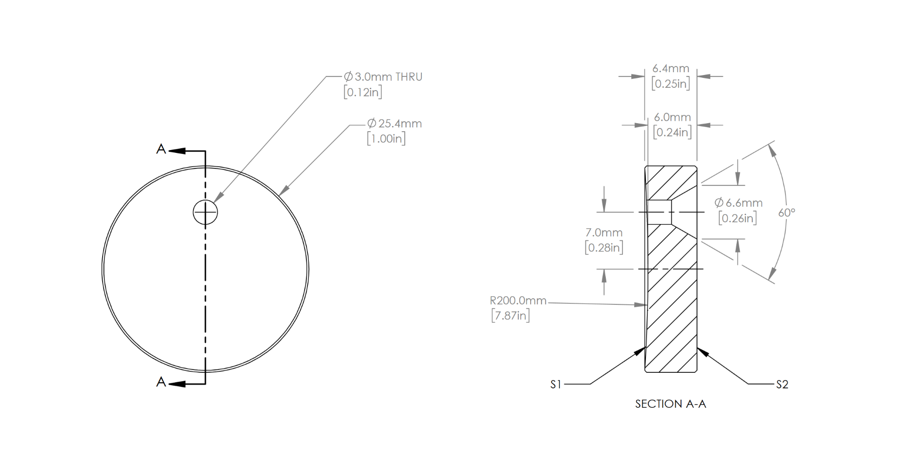

# Multireflection

## TODO
- [x] Apply a circle mask to generated images
- [x] Dataset class
- [x] MLP model that returns (x,y)

## Setup description
### Two concave 1-in **mirrors** facing each other at a distance of 9cm.

Entrance mirror:

The second mirror is identical, except for the missing laser etrypoint.

### Laser beam enters the cavity at the middle of the entrypoint
Laser is directed in the following way:

| Trial # | X_Tilt | Y_Tilt | X Degrees | Y Degrees |
|:-------:|:------:|:------:|:---------:|:---------:|
|**1**|4.0|6.0|?|?|
|         |        |        |           |           |


## Data description
Monochrome images 250x250px stored in ```data/x{$X_TILT}_y{$Y_TILT}``` folder 
