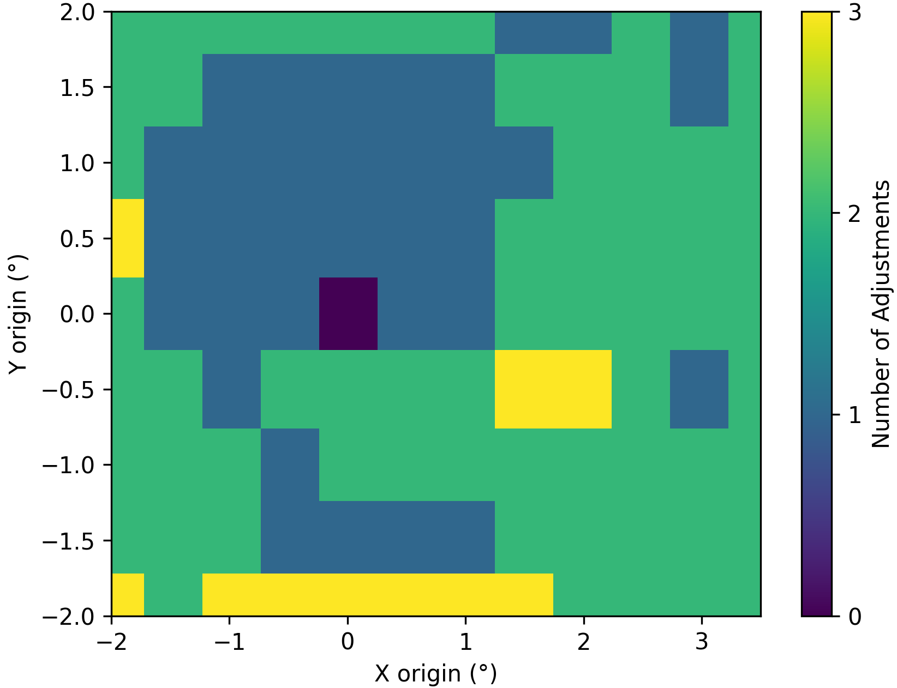

# Deep-Learning-Enabled Autonomous Alignment of Multipass Herriott Cells for Gas Detection

<!-- If you have a preprint or publication link, uncomment and update: -->
<!-- [](https://arxiv.org/abs/XXXX.XXXXX) -->

A lightweight deep learning system that autonomously aligns Herriott optical cavities using camera feedback and low-cost stepper motors. The system runs entirely on a Raspberry Pi 4, achieves 100% alignment success across the full operational range, and converges in fewer than two steps on average — enabling field-deployable gas sensors that can recalibrate themselves without human intervention.

---

## System Overview

<p align="center">
  
</p>

The system consists of a camera, two stepper motors coupled to a kinematic mirror mount, a GRIN lens laser source, a Herriott cell, and a Raspberry Pi 4 that handles both image acquisition and motor control.

<p align="center">
  
</p>

## How It Works

### Herriott Cell

A Herriott cell uses two opposing concave mirrors to bounce a laser beam back and forth, creating a long optical path in a compact volume. This extended path length makes the cell highly sensitive to trace gas concentrations — but also highly sensitive to mirror misalignment.

<p align="center">
  
</p>

### What the Model Sees

A camera captures the reflection pattern on the mirror surface. The image is cropped, resized to 512×512, converted to grayscale, and masked to isolate the lens region. The pattern changes dramatically with alignment state:

<p align="center">
  
  &nbsp;&nbsp;
  
  &nbsp;&nbsp;
  
</p>
<p align="center">
  <em>Left:</em> Optimal &nbsp;&nbsp;|&nbsp;&nbsp; <em>Center:</em> Suboptimal &nbsp;&nbsp;|&nbsp;&nbsp; <em>Right:</em> Misaligned
</p>

### Alignment Loop

The system operates in a closed loop. At each iteration, it captures an image, preprocesses it, and compares it to a reference image of optimal alignment using the Structural Similarity Index (SSIM). If SSIM exceeds 0.97 (corresponding to <0.07° angular error), alignment is complete. Otherwise, a ResNet-18 regression model predicts the angular correction needed, which is translated into stepper motor commands. The process typically converges in 1–2 steps.

## Results

The system was evaluated across the full mirror actuation range (X: −2° to +4°, Y: −2° to +2°) with starting positions spaced 0.5° apart. Results are averaged over five complete runs.

| Metric | MLP | ResNet-18 |
|---|---|---|
| Success rate | 100% | 100% |
| Time to align | 4.97 ± 2.56 s | **3.07 ± 1.58 s** |
| Number of adjustments | 1.76 ± 0.62 | 1.80 ± 0.79 |
| Final SSIM | **0.983 ± 0.002** | 0.977 ± 0.007 |
| Final angular error | **0.019° ± 0.017°** | 0.045° ± 0.021° |
| RAM usage | 1034 MiB | **83 MiB** |
| Inference time | 1.72 s | **1.16 s** |

ResNet-18 was selected for deployment due to its 12× lower memory footprint and faster inference, making it suitable for resource-constrained edge platforms.

<p align="center">
  
</p>
<p align="center">
  <em>Number of adjustments needed to reach optimal alignment from each starting position. Most of the operational range converges in 1–2 steps.</em>
</p>

<!-- 
## Citation

If you use this work, please cite:

```bibtex
@article{venediktov2025herriott,
  title   = {Deep-Learning-Enabled Autonomous Alignment of Multipass Herriott Cells for Gas Detection},
  author  = {Venediktov, Evgenii and Zhong, Shuda and Zhang, Guangyin and Splain, Zach and Chauhdry, Majid H. M. and Ikpeazu, Emeka and Mao, Zhi-Hong and Wright, Ruishu F. and Lalam, Nagesh and Chen, Kevin P.},
  year    = {2025}
}
```


## Installation

*Coming soon.*

## Usage

*Coming soon.*

## Repository Structure

*Coming soon.*

## License

*TBD*
 -->

## Acknowledgments

This work was supported by the University of Pittsburgh.